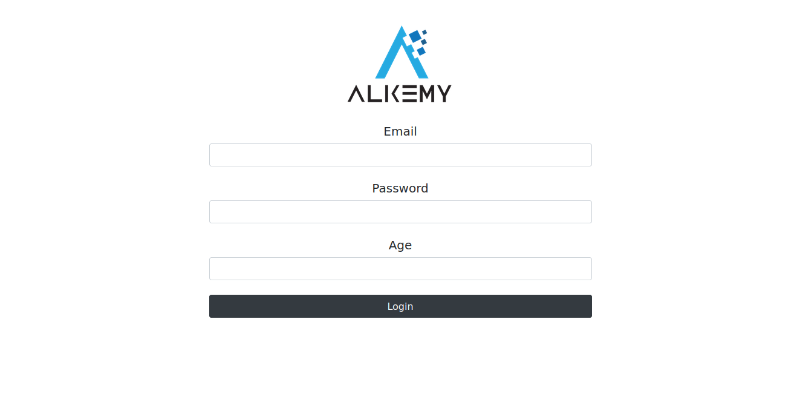
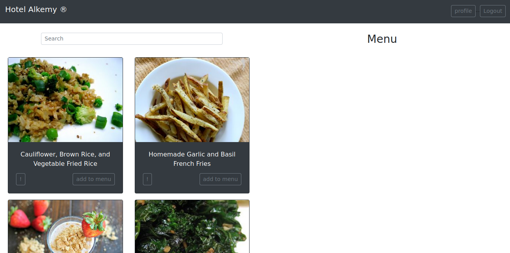
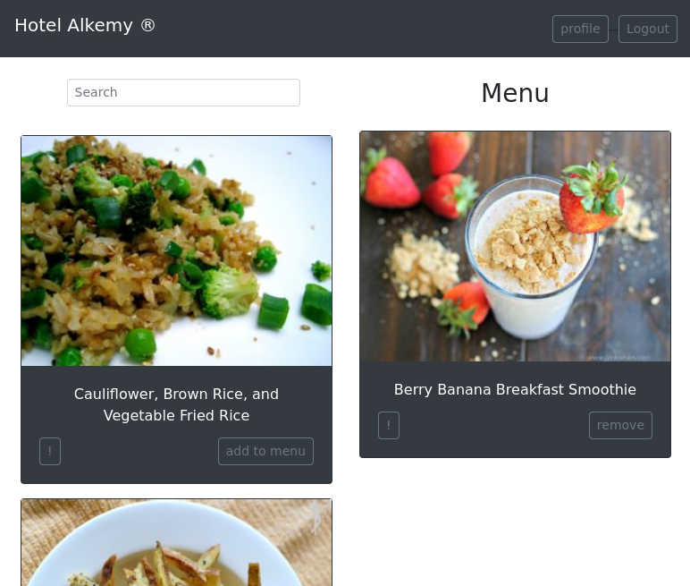
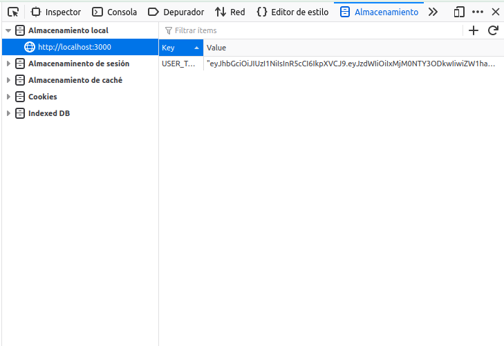
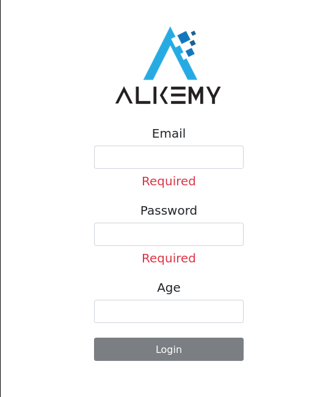
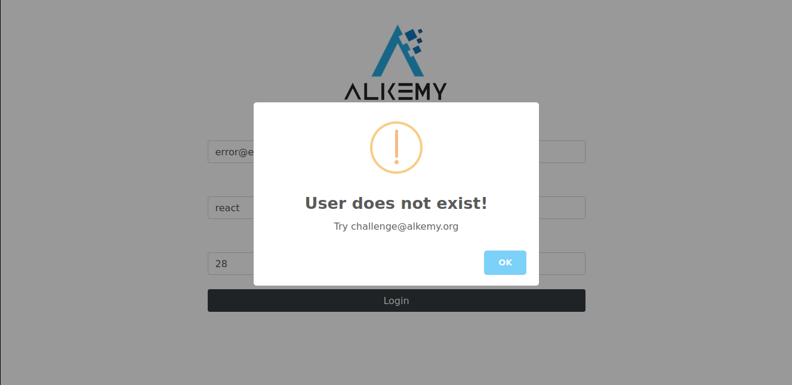
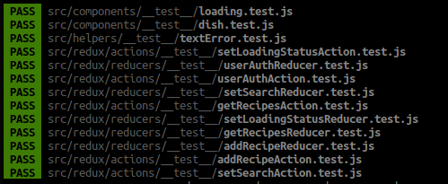

<p align="center">
    
    <hr width="100%"/>
    <h1 align="center">Hotel menu challenge</h1>
</p>
<p align="center">
    
    
    
    
    
    
    
</p>
<p align="center">
    
</p>

## 🛠️ Installation Steps

```bash
git https://github.com/FedericoGabrielCastro/hotelAlkemy.git
cd hotel-alkemy
npm install
npm start
```

🌟 You are all set!

<p align="center">
    
    
    
    
    
    
    
</p>